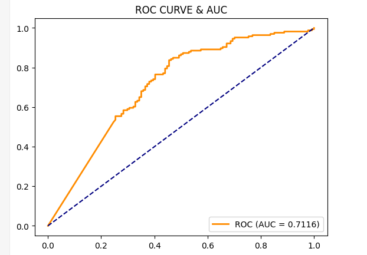
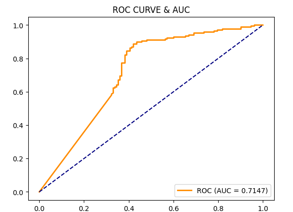

# Movie Recommendation

This project builds a Movie Recommendation System based on the **Naive Bayes** machine learning algorithm, inspired by and improved upon a scientific research paper on recommendation systems. The system analyzes users' movie-watching history and their similarity to generate a list of movies that a specific user has the highest probability of liking.

[Reference] (https://www.researchgate.net/publication/337596162_Design_and_Implementation_of_Movie_Recommendation_System_Based_on_Naive_Bayes)

## Main Features 
1. **Target User History Extraction:** Retrieves the entire movie rating history of the target user and classifies them as Liked (>= 4.0) or Disliked.
2. **Same Preference Search:** Finds all other users who have watched the target movie, then compares their shared history with the target user. If they share similar ratings for past movies, they are considered to have the "same preference".
3. **Bayes Calculation:** Based on the group of users with the same preference, the system counts the number of times the target movie received a high rating (`high_score_time`) and a low rating (`low_score_time`).
4. **Laplace Smoothing:** Applies a smoothing formula with parameter a=0.1 to avoid zero-probability errors: 
   $$P = \frac{\text{Numerator} + a}{\text{Denominator} + 2a}$$
5. **K-Core Filtering (K=20):** A crucial technique to address data sparsity. The system automatically removes statistical noise by retaining only users who have rated at least 20 movies and movies that have received at least 20 ratings. 
   *(Project improvement compared to the original paper)*
6. **Data Merging:** Combines the 3 tables (`ratings`, `users`, and `movies`) into a single DataFrame containing all information.

## Directory Structure
- `data/`: Contains tabular datasets (`u.data`, `u.genre`, etc.).
- `src/`: Scripts for data processing and model training.
- `predict.py`: The main executable file. Input the ID of the user you want to predict recommendations 
- `notebooks/`: Exploratory Data Analysis (EDA) & model evaluation.


## Dataset
The dataset is sourced from the **MovieLens 100K dataset**.
- Download the file using the following command:
```
wget https://files.grouplens.org/datasets/movielens/ml-100k.zip
```


## Usage instructions

### Docker

```
docker build -t movie-recommender .
docker run --rm -it movie-recommender
```
## 📊 Evaluations (Before & After)

Experimental results on an independent Test set demonstrate an improvement in classification metrics.
### 🔻 Initial State (Original model without K-Core filtering)
*(ROC Curve when implemented with the paper's parameters)*


[]


### 🌟 Improved State
*(ROC Curve after optimization)*

[]

---
- Achieved stability with an F1-Score hovering around 0.8000 <Higher than which is set up on the original paper>
### 4. Credits
- HongSon507 inspired from Design and Implementation of Movie Recommendation System Basedon Naive Bayes(2019)
- Download free Movielens 100K dataset
### 5. Future improvements
- Integrate LLMs to build a Hybrid Recommender System:

    * **Use LLM models:**  (such as SentenceTransformers, Llama 3, or OpenAI API) to extract semantic vectors (Text Embeddings) from movie synopses and genres.

    * Combine this vector similarity with Naive Bayes probabilities to create a "hybrid" system, increasing overall accuracy and solving the cold-start problem for newly released movies.

- Utilize Semantically Rich Datasets: Incorporate datasets with more features to further reduce data sparsity.
- Exploit Temporal Dynamics in the Dataset:
   * **Problem:** Currently, reviews from 10 years ago and yesterday carry equal weight, whereas a person's "taste" changes over time.
   * **Optimization strategy:** Introduce a Time-decay function into the Naive Bayes frequency calculation. Recent ratings will be given higher weights, helping the model adapt to the user's current preferences.
- Benchmark with Advanced Models: Implement modern recommender algorithms like Matrix Factorization (SVD) or Deep Learning (Neural Collaborative Filtering) to directly compare performance against Naive Bayes.
# License
This project is licensed under the MIT License - see the [LICENSE](LICENSE) file for details.

